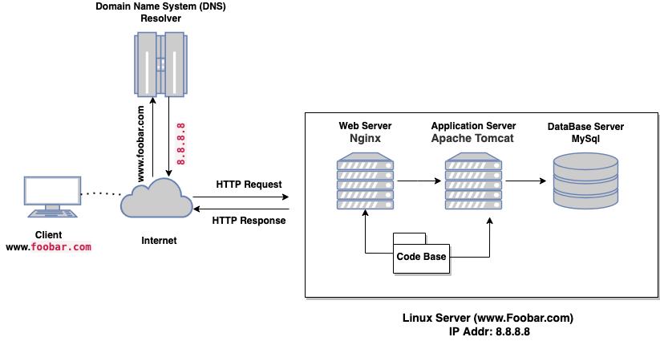

#   Simple Web Stack

##  Description
This is a simple web infrastucture of www.foobar.com, composed of LAMP (Linux, Apache server, MySql and PHP) stack. It illustrates the process taken when a host is trying to access a website.

##  some specifics about this infrastructure:
-   What is a server: 
        A server can simply be defined as a special computer which have peculiar features other than a normal computer in term of Operating system, number of request taken, preprocessor and others. The main function of a server is to provide resources, data, services, program to other computers known as the client over a network
-   What is the role of the domain name:   The major role of a domain name is to proviade a human readable alias for IP address. 
-   What type of DNS record www is in www.foobar.com:-    The Domain name <b>www.foobar.com</b> is converted to IP address <b>8.8.8.8</b>using a <b>A RECORD</b> which translate it to address that can be found because servers only understands numbers
-   What is the role of the web server:-     This is a server that provides a static web page through the HTTP/S (Hyper Text Transfer Protocol) to the client.
-   What is the role of the application server: This is a server that provides a dynamic web page to the client through the HTTP/S protocol. In this type of server, we can interract with the database for storing, retrieving and loading of website.
-   What is the role of the database:  Major role to maintain a collection of organized information that can easily be accessed, managed and updated
-   What is the server using to communicate with the computer of the user requesting the website:  It uses TCP/IP protocol(Transmission control protocol / Internet protocol).
##   Issues with the above infrastructure
-   Single Point Of Failure (SPOF):  This is a great factor that affects the the infrastructure provided above based on the fact that if any of the infrastructure get spoilt or has fault, there is no replace for it.
-   Downtime when maintenance needed (like deploying new code web server needs to be restarted):-  
Anytime you have to make some maintenace on the infrastructure, you have to put off one of the infrastructure which will lead to downtime for all the connected infrastructure.
-   Cannot scale if too much incoming traffic:-  
In this case, if requeste are being sent to the server and unfortunately it got to the peak that the server can not take in any request anymore, the server might crash.
