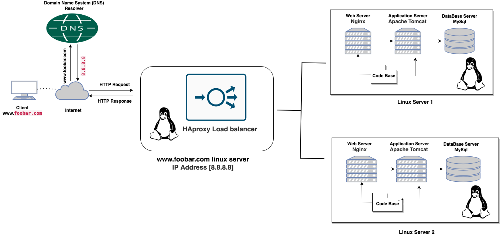

#   Distributed web infrastructure

[visit the whitebord](https://app.diagrams.net/#G1qtI9ti5jdmUsBjBl4mWDt4XauQiR_H2r)
##  Description
The distributed web infrastructure is a type of architecture that distributes web trafic to two servers with the help of a load balancer to improve performance, availability and also prevents overloading a server.
##  some specifics about this infrastructure
-   For every additional element, why you are adding it:-   For every additional element added to the infrastructure, it helps to increase the reliability of the server. In the sense that if an element is down, the other element can easily take control, pending the time the element that is down recovers.
-   What distribution algorithm your load balancer is configured with and how it works:-   The algorithm configured by the load balancer designed is the Round Robin algorithm which works in the sense that the traffic going into the server are being distributed in a sequential way, that is: if client-1 connect to the load balancer, it directs it to the server-1. When server-2 is coming from the load balancer, it goes to the server-2. Client-3 to server-1, client-4 to server-2 and distribution goes with that pattern.
-   Is your load-balancer enabling an Active-Active or Active-Passive setup, explain the difference between both:-    Active-Active setup is a type of setup whereby all the servers are active and working whereby they all accepts incoming traffic. And Active-Passive setup is a type whereby the some of the server are active i.e can accept incoming traffic and the other server are passive i.e: they don't allow incoming traffic until the active servers goes down, so they can work.
-   How a database Primary-Replica (Master-Slave) cluster works:  A Primary-Replica setup configures a server to act as the Primary server and the other many server to act as a Replica of the Primary server. However, the Primary server is capable of performing read/write requests whilst the Replica servers is only capable of performing read requests. Data is synchronized between the Primary and Replica servers whenever the Primary server executes. We can improve the scalabilty and availability of the database with this cluster.
-   What is the difference between the Primary node and the Replica node in regard to the application:-   The Primary node is responsible for all the write operations the site needs whilst the Replica node is capable of processing read operations, which decreases the read traffic to the Primary node.
##  what the issues are with this infrastructure
-   Where are SPOF:-   For example, if the Primary MySQL database server is down, the entire site would be unable to make changes to the site (including adding or removing users). The server containing the load balancer and the application server connecting to the primary database server are also SPOFs.
-   Security issues (no firewall, no HTTPS):-   The data transmitted over the network isn't encrypted using an SSL certificate so hackers can spy on the network. There is no way of blocking unauthorized IPs since there's no firewall installed on any server.
-   No monitoring:-   We have no way of knowing the status of each server since they're not being monitored.
