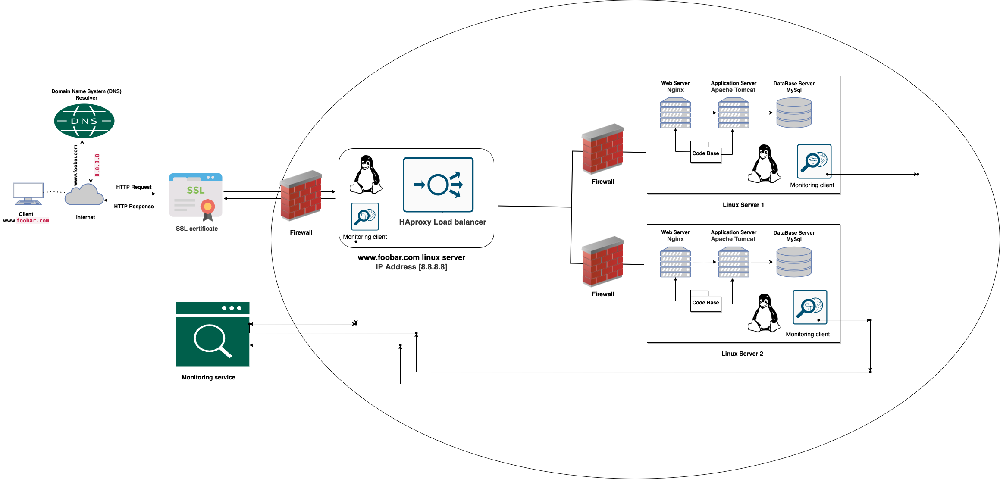

#   Secured and monitored web infrastructure

[visit the whitebord](https://app.diagrams.net/#G1qtI9ti5jdmUsBjBl4mWDt4XauQiR_H2r)
##  Description
This is an architecture that is secured, serve encrypted traffic, and is monitored.

##  Some specifics about this infrastructure
-   Why is additional element added:-   For every additional element added to the infrastructure, it helps to increase the reliability of the server. In the sense that if an element is down, the other element can easily take control, pending the time the element that is down recovers.
-   Purpose of firewalls:-   The firewalls are for protecting the network (web servers, anyway) from unwanted and unauthorized users by acting as an intermediary between the internal network and the external network and blocking the incoming traffic matching the aforementioned criteria.
-   Purpose of serving traffic over HTTPS:-   The HyperText Transfer Protocol Secure is used to secure the servers against being hacked by providing a TLS (Transport layer security) or SSL (Secure socket layer) over the HTTP protocol.
-   Purpose of monitoring the server:-    The monitoring clients are for monitoring the servers and the external network. They analyse the performance and operations of the servers, measure the overall health, and alert the administrators if the servers are not performing as expected. The monitoring tool observes the servers and provides key metrics about the servers' operations to the administrators. It automatically tests the accessibility of the servers, measures response time, and alerts for errors such as corrupt/missing files, security vulnerabilities/violations, and many other issues.
-   What is QPS monitoring:-   Queries-per-second (QPS) (or the query-per-second rate) is a measure of how much traffic a particular query server is handling at a given time.

##  Issues with the infrastructure:
-   Terminating SSL at the load balancer level would leave the traffic between the load balancer and the web servers unencrypted.
-   Having one MySQL server is an issue because it is not scalable and can act as a single point of failure for the web infrastructure.
-   Having servers with all the same components would make the components contend for resources on the server like CPU, Memory, I/O, etc., which can lead to poor performance and also make it difficult to locate the source of the problem. A setup such as this is not easily scalable.
